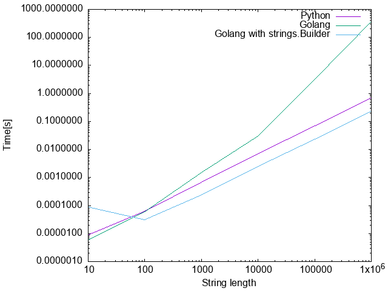

# String concatenation mystery

A very simple problem seems to be O(n^2) in golang, but O(n) in python. Why?



Let's dig and see

How?

Let's use black-box solution - just dig cpython source code _history_.


```
git clone https://github.com/python/cpython.git
cd cpython

mkdir ../target

target=$(cd ../target; pwd)
./configure --target=$target --enable-optimizations
make -j 4 python
./python ../main.py 
10 1.5735626220703125e-05
100 7.796287536621094e-05
1000 0.0009021759033203125
10000 0.00934290885925293
100000 0.09724044799804688
1000000 0.9724068641662598
git log | grep -B 2 2019 + | head -n 3
commit d0c92e81aa2171228a23cb2bed36f7dab975257d
Author: Batuhan Taşkaya <47358913+isidentical@users.noreply.github.com>
Date:   Tue Dec 31 05:31:52 2019 +0300
git checkout d0c92e81aa2171228a23cb2bed36f7dab975257d
./configure --target=$target --enable-optimizations
make -j 4 python

./python ../main.py
10 1.52587890625e-05
100 9.274482727050781e-05
1000 0.001028299331665039
10000 0.011281967163085938
100000 0.11533236503601074
1000000 1.1466484069824219
```
So, in 2019 optimisation _was already there_.

```
git log | grep -B 2 '2010 +' | head -n 3
commit 8dff4bada79d3662f8c799ea4572d51a2f8eed0a
Author: Raymond Hettinger <python@rcn.com>
Date:   Fri Dec 31 23:23:06 2010 +0000
git clean -f
git checkout 8dff4bada79d3662f8c799ea4572d51a2f8eed0a 
```
build failed!


```
git log | grep -B 3 '2015 +' | head -n 3
commit 288cb25f1a208fe09b9e06ba479e11c1157da4b5
Merge: 58f8833e4c 42bf8fc901
Author: Serhiy Storchaka <storchaka@gmail.com>
git checkout 288cb25f1a208fe09b9e06ba479e11c1157da4b5
./configure --target=$target --enable-optimizations
make -j 4
./python ../main.py 
10 1.1205673217773438e-05
100 7.534027099609375e-05
1000 0.0008046627044677734
10000 0.008290529251098633
100000 0.07796096801757812
1000000 0.7712376117706299
```

So, even in 2015, the thing _was already there!_

going back to 2012(!)

```
commit b4f39e85f2199bb9344e9b49feed3f6a45a318de
Merge: 8d518970ce 5051ca887c
Author: Giampaolo Rodola' <g.rodola@gmail.com>
Date:   Mon Dec 31 17:38:46 2012 +0100
```
to build this, I had to 

```
cp Modules/Setup.dist Modules/Setup
make -j 4
./python ../main.py 
10 1.0728836059570312e-05
100 7.534027099609375e-05
1000 0.0007674694061279297
10000 0.008090734481811523
100000 0.08159112930297852
1000000 0.7396862506866455
